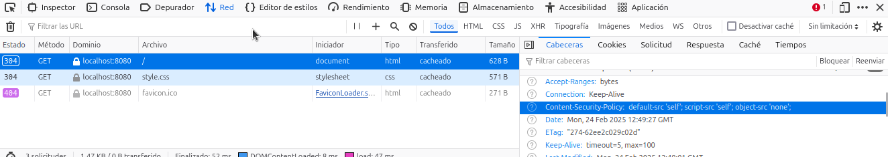
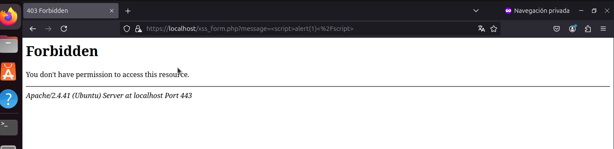
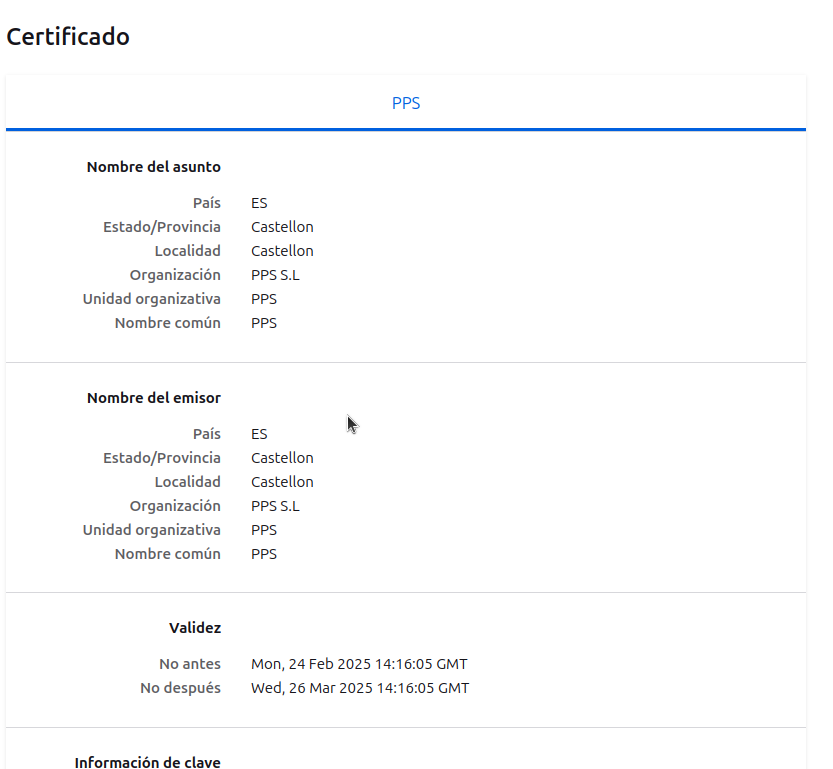

# Prácticas Docker - Seguridad Web y ModSecurity

Este repositorio contiene varias prácticas centradas en la creación, configuración y protección de servidores web Apache dentro de contenedores Docker. Las prácticas están orientadas a mejorar la seguridad de las aplicaciones web mediante herramientas como **Content Security Policy (CSP)**, **OWASP ModSecurity CRS** y el módulo **mod_evasive** para prevenir ataques de denegación de servicio (DoS). Además, se incluyen pasos para la instalación de un certificado SSL autofirmado en el servidor Apache para mejorar la seguridad en las comunicaciones.

---

## Resumen del Proceso

### Práctica 3.1.1: Implementación de Content Security Policy (CSP)

En esta primera práctica, se configuró **Content Security Policy (CSP)** en un servidor Apache dentro de un contenedor Docker. CSP es una medida de seguridad que ayuda a mitigar ataques como **Cross-Site Scripting (XSS)** al restringir las fuentes de contenido permitidas en una página web.

**Pasos realizados:**
- Instalación de **Apache** en un contenedor Docker basado en Ubuntu.
- Configuración de los encabezados de **CSP** en el archivo de configuración de Apache.
- Restricción de fuentes de contenido externo para evitar ejecución de scripts maliciosos.
- Pruebas con contenido embebido y scripts inline para verificar la efectividad de CSP.

**Imagen Docker con CSP (Práctica 1)**:  
[Enlace a Docker Hub](https://hub.docker.com/repository/docker/pps10198054/pr3.1.1/general)

### Práctica 3.1.2 y 3.1.3: Instalación y Configuración de OWASP ModSecurity

La tercera práctica consistió en la instalación y configuración de **OWASP ModSecurity CRS** (Core Rule Set) para proteger el servidor Apache contra una amplia gama de ataques web, incluyendo inyecciones SQL, XSS y otros ataques comunes. **ModSecurity** actúa como un **firewall de aplicaciones web** (WAF), añadiendo una capa de seguridad adicional.

**Pasos realizados:**
- Instalación del módulo **mod_security2** en Apache.
- Clonación del repositorio oficial de **OWASP ModSecurity CRS** y configuración de las reglas de seguridad.
- Configuración de Apache para activar las reglas de ModSecurity y proteger el servidor.

**Prueba de funcionamiento:**
- Se creó un archivo `index.php` con una vulnerabilidad XSS a propósito.
- Se intentó realizar un ataque XSS utilizando el parámetro `?name=`.
- El **ModSecurity CRS** bloqueó el ataque, generando una respuesta **403 Forbidden**.

**Imagen Docker con ModSecurity (Práctica 3)**:  
[Enlace a Docker Hub](https://hub.docker.com/repository/docker/pps10198054/pr3.1.2/general)

**Captura de pantalla de la respuesta bloqueada por ModSecurity:**

---

### Práctica 3.1.4: Instalación y Pruebas del Módulo mod_evasive

En esta última práctica, se instaló y configuró **mod_evasive**, un módulo de Apache que mitiga ataques de **denegación de servicio (DoS)** y **fuerza bruta**. Además, se realizaron pruebas de carga para validar su funcionamiento.

#### **4.1 Instalación y Configuración de mod_evasive**
**Pasos realizados:**
- Instalación del módulo `mod_evasive` en Apache.
- Configuración de reglas de protección para limitar el número de solicitudes permitidas por cliente.
- Configuración de logs y notificaciones en caso de ataques.

#### **4.2 Pruebas de Carga y Validación**
Para comprobar el correcto funcionamiento de **mod_evasive**, se utilizó **ApacheBench (ab)** para simular múltiples solicitudes al servidor.

**Comando utilizado para la prueba de carga:**
`bash`
`ab -n 1000 -c 10 https://localhost:8080/`

---

### Práctica 3.2.1: Instalación y Configuración de un Certificado SSL Autofirmado

Para mejorar la seguridad de las comunicaciones, en esta práctica se instaló un **certificado SSL autofirmado** en Apache. Esto permite servir contenido de manera segura a través de **HTTPS**.

**Pasos realizados:**
- Generación de un certificado SSL autofirmado con **OpenSSL**.
- Configuración de Apache para usar el certificado en el puerto 443 (HTTPS).
- Modificación del `Dockerfile` para incluir la instalación del certificado.

**Imagen Docker con certificado SSL (Práctica 2)**:  
[Enlace a Docker Hub](https://hub.docker.com/repository/docker/pps10198054/pr3.1.4/general)

**Captura de pantalla del certificado en la web:**

Para probarlo, inicia el contenedor y accede a la web mediante HTTPS.

---

