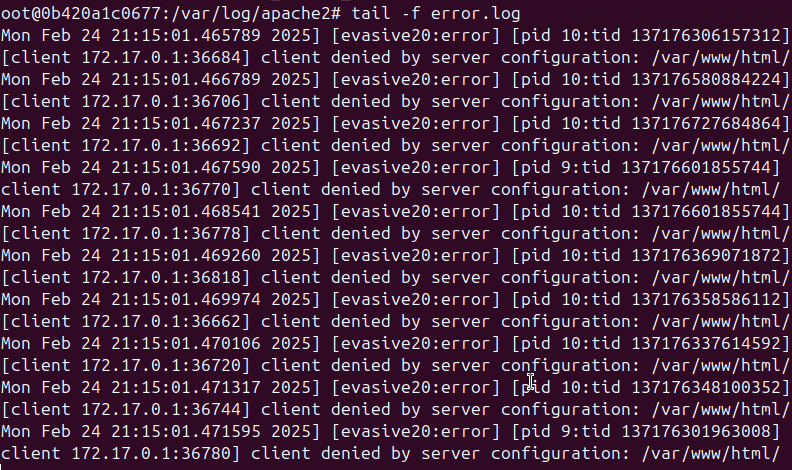

# Prácticas Docker - Seguridad Web y ModSecurity

Este repositorio contiene varias prácticas centradas en la creación, configuración y protección de servidores web **Apache** dentro de contenedores **Docker**. Las prácticas están orientadas a mejorar la seguridad de las aplicaciones web mediante herramientas como **Content Security Policy (CSP)**, **OWASP ModSecurity CRS** y el módulo **mod_evasive** para prevenir ataques de denegación de servicio (DoS). Además, se incluyen pasos para la instalación de un **certificado SSL autofirmado** en el servidor Apache para mejorar la seguridad en las comunicaciones.

---

## Resumen del Proceso

### Práctica 3.1.1: Implementación de Content Security Policy (CSP)

La **Content Security Policy (CSP)** es una medida de seguridad que ayuda a prevenir ataques como **Cross-Site Scripting (XSS)** al restringir las fuentes de contenido que una página web puede cargar. En esta práctica, se configuró CSP en un servidor **Apache** dentro de un contenedor Docker para evitar la ejecución de scripts maliciosos.

#### **Pasos realizados:**
1. **Instalación de Apache** en un contenedor Docker basado en **Ubuntu**.
2. **Configuración de los encabezados CSP** en el archivo de configuración de Apache (`apache2.conf`).
3. **Restricción de fuentes de contenido** externas, permitiendo solo fuentes de confianza.
4. **Pruebas de efectividad** utilizando contenido embebido y scripts **inline**.

#### **Resultado:**
El encabezado CSP se incluyó correctamente, impidiendo que se cargaran fuentes no autorizadas o scripts maliciosos.


**Imagen Docker con CSP (Práctica 1):**  
[Enlace a Docker Hub](https://hub.docker.com/repository/docker/pps10198054/pr3.1.1/general)

---

### Práctica 3.1.2 y 3.1.3: Instalación y Configuración de OWASP ModSecurity

La implementación de **OWASP ModSecurity CRS** proporciona una capa adicional de protección contra una variedad de ataques web comunes, como **inyecciones SQL** y **Cross-Site Scripting (XSS)**.

#### **Pasos realizados:**
1. Instalación del módulo **mod_security2** en Apache.
2. Clonación del repositorio **OWASP ModSecurity CRS**.
3. **Configuración de las reglas de seguridad** de OWASP CRS para detectar y bloquear ataques.
4. Activación de **ModSecurity** en Apache para proteger el servidor web contra ataques comunes.

#### **Prueba de funcionamiento:**
Se creó un archivo `index.php` con una vulnerabilidad XSS a propósito y se intentó realizar un ataque XSS. **ModSecurity CRS** bloqueó el ataque y generó una respuesta **403 Forbidden**.


**Imagen Docker con ModSecurity (Práctica 3):**  
[Enlace a Docker Hub](https://hub.docker.com/repository/docker/pps10198054/pr3.1.2/general)

---

### Práctica 3.1.4: Instalación y Pruebas del Módulo mod_evasive

En esta práctica, se instaló y configuró el módulo **mod_evasive** de Apache para mitigar ataques de **denegación de servicio (DoS)** y **fuerza bruta**. **mod_evasive** ayuda a prevenir la sobrecarga del servidor al limitar el número de solicitudes permitidas por cliente.

#### **4.1 Instalación y Configuración de mod_evasive**
**Pasos realizados:**
1. Instalación de **mod_evasive** en Apache.
2. **Configuración de reglas de protección** para limitar el número de solicitudes permitidas por cliente en un período corto de tiempo.
3. Configuración de **logs y notificaciones** por correo electrónico en caso de ataques.

#### **4.2 Pruebas de Carga y Validación**
Para comprobar el funcionamiento de **mod_evasive**, se utilizó **ApacheBench (ab)** para realizar un ataque de **denegación de servicio (DoS)** simulado con **1000 solicitudes** concurrentes.

- **Comando utilizado para la prueba de carga:**

    ```bash
    ab -n 1000 -c 10 https://localhost:8080/
    ```

A continuación se muestra la validación del bloqueo de peticiones por parte de Apache:



**Imagen Docker con mod_evasive (Práctica 4):**  
[Enlace a Docker Hub](https://hub.docker.com/repository/docker/pps10198054/pr3.1.4/general)

---

### Práctica 3.2.1: Instalación y Configuración de un Certificado SSL Autofirmado

Para asegurar las comunicaciones entre el servidor y los usuarios, se instaló un **certificado SSL autofirmado** en el servidor Apache. Esto permite que las conexiones sean cifradas a través de **HTTPS**.

#### **Pasos realizados:**
1. Generación de un **certificado SSL autofirmado** utilizando **OpenSSL**.
2. Configuración de **Apache** para usar este certificado en el puerto **443** (HTTPS).
3. Modificación del **Dockerfile** para incluir la instalación y configuración del certificado SSL.

#### **Generación del certificado SSL (fuera del contenedor):**

```bash
mkdir -p certs
openssl req -x509 -nodes -days 365 -newkey rsa:2048 \
    -keyout certs/apache-selfsigned.key \
    -out certs/apache-selfsigned.crt \
    -subj "/C=US/ST=State/L=City/O=Organization/OU=IT/CN=localhost"
```
Una vez generado el certificado localmente, se copia al contenedor durante la construcción de la imagen Docker.

### Captura de pantalla del certificado SSL en la web:


### Imagen Docker con Certificado SSL (Práctica 2):
[Enlace a Docker Hub](https://hub.docker.com/repository/docker/pps10198054/pr3.1.4/general)

Para probarlo, inicia el contenedor y accede a la web mediante **HTTPS**.


