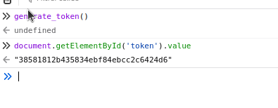
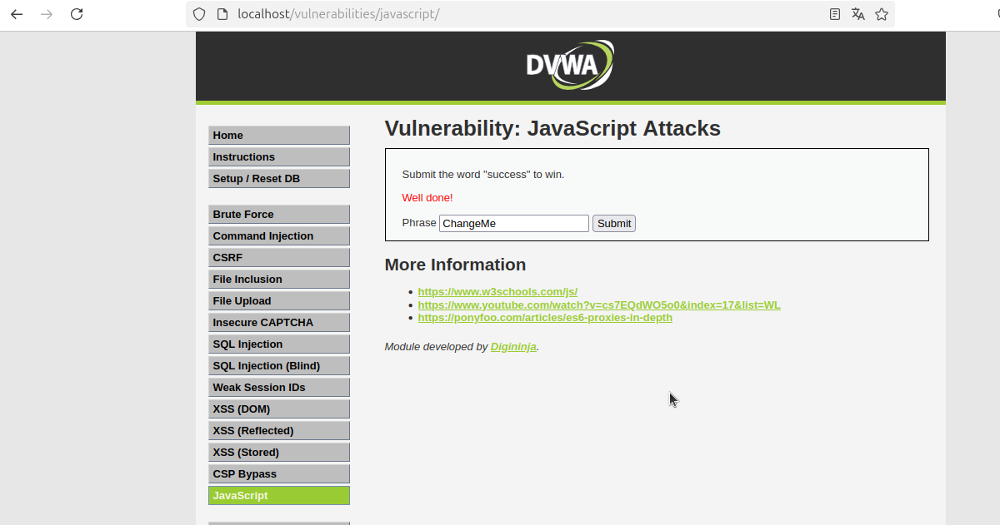

## Security Level: Low

En este nivel, se nos solicita enviar la palabra "success" para ganar.

Tenemos la frase `ChangeMe` y debemos cambiarla a "success". Además, hay un token cuyo valor es `md5(rot13(phrase))`.

### Cálculos:

1. **rot13("success")** = `fhpprff`
2. **md5("fhpprff")** = `38581812b435834ebf84ebcc2c6424d6`

Por lo tanto, el valor del token y la frase será:

```plaintext
token=38581812b435834ebf84ebcc2c6424d6&phrase=success
```

Para obtener el token, podemos ejecutar la función `generate_token()` en la consola del navegador. Esto generará el valor correcto para el token.

Ahora, podemos enviar el siguiente valor:

En este caso, **`generate_token()`** es la función que se ejecuta en la consola para obtener el valor del token, lo que lo hace más interactivo y útil para el ejercicio.



Para finalizar, debemos poner `ChangeMe` en el formulario y hacer clic en el botón **Submit** para completar el ejercicio.



