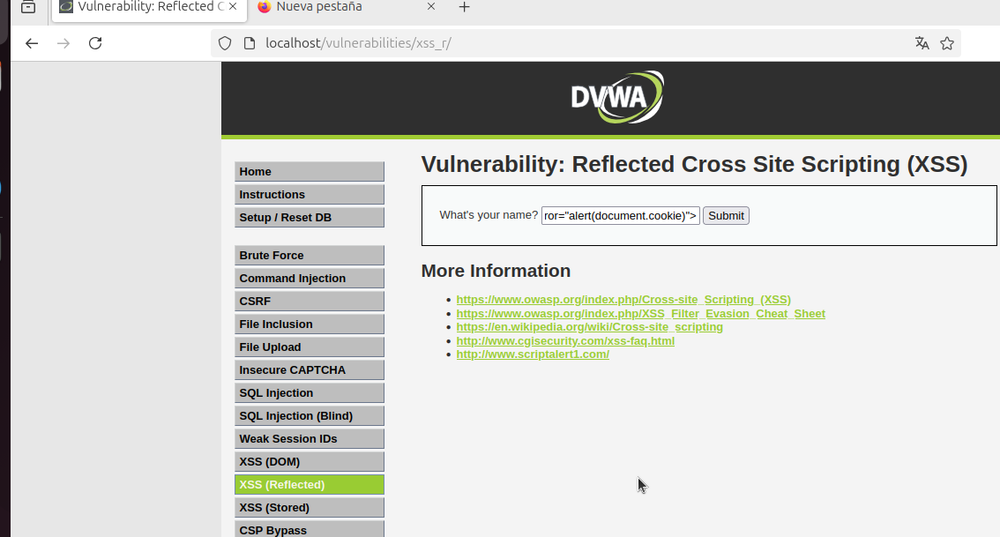
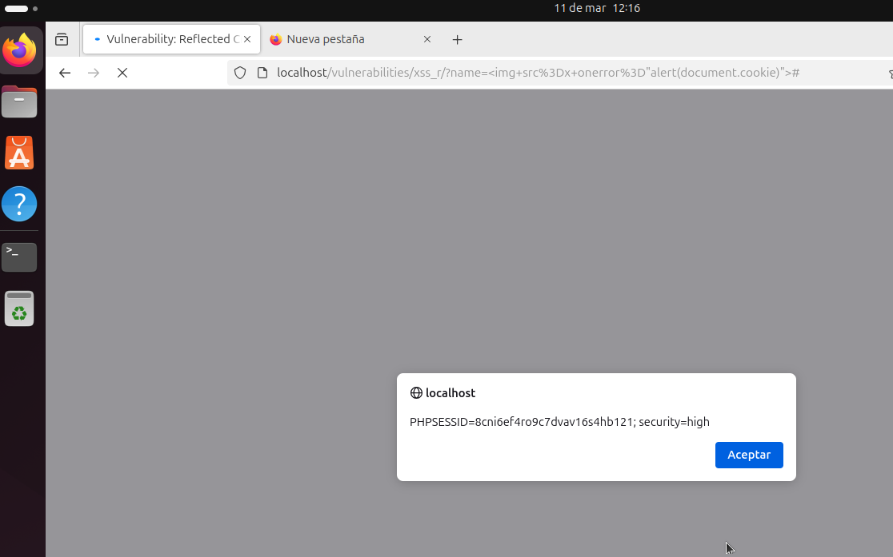

# Reflected Cross Site Scripting (XSS) - DVWA (Security Level: High)

## Descripción del Ataque

**Reflected XSS** es una variante del ataque **Cross-Site Scripting (XSS)**, donde el código malicioso inyectado por un atacante se refleja inmediatamente en la respuesta del servidor. Este tipo de ataque se produce cuando un sitio web refleja datos proporcionados por el usuario en la página sin validarlos o limpiarlos adecuadamente. En un entorno de **DVWA** con el nivel de seguridad **alto**, el servidor puede estar filtrando algunos scripts, pero aún es posible explotar esta vulnerabilidad utilizando técnicas específicas.

### **Payload Utilizado:**

**Payload:**

```html

```

Este **payload** inyecta una etiqueta ``, que, cuando el servidor la refleja en la página, ejecuta un script que muestra las cookies del navegador a través de un `alert`.

## Explicación del Proceso

1. **Reflected XSS**: El servidor refleja el payload directamente en la respuesta de la página sin validarlo correctamente. En este caso, el payload que se inyecta es una etiqueta de imagen (``), que contiene un **event handler** (en este caso `onerror`) que ejecuta el código malicioso.

2. **Uso del `onerror`**: Si el servidor no valida el `src` de la imagen, el error generado por la carga de una imagen inexistente (en este caso `x`) disparará el evento `onerror`. Esto provoca la ejecución del script de JavaScript que inyectamos.

3. **Mostrar las cookies del navegador**: El script que se inyecta es simple: `alert(document.cookie);`. Este script muestra las cookies del navegador, lo cual puede ser útil para un atacante que quiera robar las credenciales o la sesión de un usuario (session hijacking).

## Proceso para Realizar el Ataque

### Paso 1: Identificar la vulnerabilidad

En DVWA, ve a una sección donde puedes interactuar con el sistema, como por ejemplo un formulario de búsqueda, comentarios o cualquier entrada que refleje datos del usuario en la respuesta de la página.

### Paso 2: Inyectar el Payload

Introduce el siguiente payload en el campo de entrada:

```html

```

### Paso 3: Ejecutar el Ataque

Cuando el payload sea reflejado, el script `alert(document.cookie)` se ejecutará en el navegador y mostrará las cookies de la página en una ventana emergente (alerta).



### Output:

Cuando el payload se ejecuta correctamente, el navegador mostrará una alerta con las cookies almacenadas, algo como esto:



