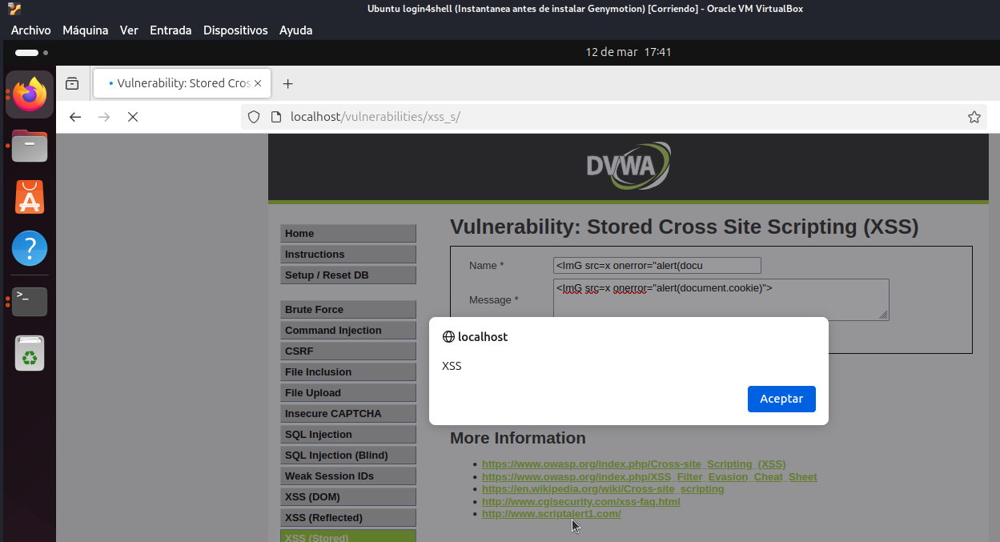

# Stored Cross Site Scripting (XSS) - DVWA

## Descripción del Ataque

El **Stored Cross Site Scripting (XSS)** es una vulnerabilidad donde un atacante puede inyectar código malicioso que se almacena de manera persistente en el servidor y es reflejado a los usuarios cuando acceden a la página. En este caso, la vulnerabilidad está presente en el campo de mensaje de DVWA.

## Security Level: High

En el nivel de seguridad alto, la aplicación ha implementado una protección más robusta, bloqueando las etiquetas `<script>`. Sin embargo, aún es posible realizar un ataque de XSS utilizando una técnica diferente.

### Proceso para Realizar el Ataque

#### Paso 1: Identificar la Vulnerabilidad

En este caso, el campo de entrada **nombre** sigue siendo vulnerable a la inyección de código. Sin embargo, la aplicación bloquea el uso de las etiquetas `<script>`, por lo que no podemos inyectar código JavaScript directamente.

#### Paso 2: Inyectar el Payload

Podemos modificar la entrada y utilizar una técnica alternativa para ejecutar el código malicioso. Usamos una etiqueta `` con un manejador de errores `onerror` para ejecutar el código JavaScript cuando la imagen no se carga correctamente. El payload sería:

```html

```

Este payload funciona de manera similar al de los niveles anteriores, pero en lugar de usar un `<script>`, utilizamos un `` para disparar el código JavaScript al producirse un error en la carga de la imagen (en este caso, cuando el recurso `x` no está disponible).

Cuando el campo con el mensaje es mostrado en el navegador de otro usuario, el código malicioso se ejecuta, mostrando una alerta con las cookies del documento.




