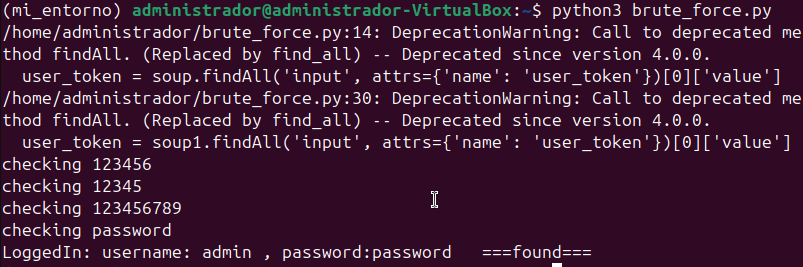
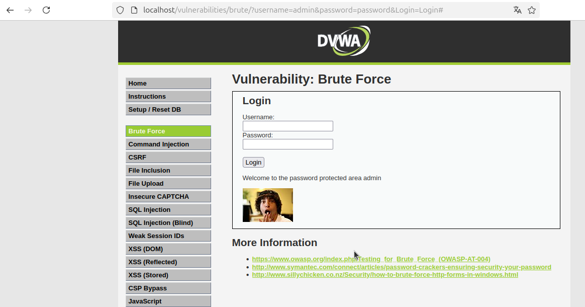

# Solución del Ejercicio: Brute Force con CSRF Token (Nivel de Seguridad: Alto)

Este ejercicio pertenece al entorno DVWA (Damn Vulnerable Web Application) y tiene como objetivo realizar un ataque de fuerza bruta sobre una página protegida por un token CSRF (Cross-Site Request Forgery). La aplicación utiliza un parámetro adicional llamado `user_token` para protegerse contra ataques CSRF, pero este token puede ser extraído y reutilizado para realizar el ataque.

## Descripción del Ejercicio

El objetivo es realizar un ataque de fuerza bruta para encontrar la contraseña del usuario `admin`. En este caso, el ejercicio tiene una capa adicional de seguridad debido a la implementación de un token CSRF (`user_token`), lo que hace que herramientas como Hydra no sean suficientes para realizar el ataque.

### Pasos para Resolver el Ejercicio

1. **Acceder a la Página de Inicio**: 
   Primero, realizamos una solicitud HTTP GET a la página de inicio (`http://127.0.0.1/vulnerabilities/brute/`). En esta página, el servidor devuelve un formulario de inicio de sesión con un token CSRF oculto en un campo de entrada.

2. **Obtener el Token CSRF**:
   Utilizamos **BeautifulSoup** para extraer el valor del token CSRF (`user_token`) de la página de inicio. Este valor se encuentra en un campo oculto del formulario, y necesitamos incluirlo en cada solicitud de inicio de sesión.

3. **Leer el Diccionario de Contraseñas**:
   Usamos un diccionario de contraseñas (`rockyou.txt`) para realizar el ataque de fuerza bruta. Por cada intento de contraseña, enviamos una solicitud con el nombre de usuario `admin` y la contraseña probada.

4. **Incluir el Token CSRF en la Solicitud**:
   En cada intento de inicio de sesión, nos aseguramos de que el token CSRF actualizado se incluya en la solicitud. Esto es necesario para evitar que el servidor rechace la solicitud debido a un token inválido.

5. **Verificar el Éxito del Inicio de Sesión**:
   Si la respuesta del servidor contiene el texto "Welcome", sabemos que hemos iniciado sesión correctamente. El script termina y muestra el nombre de usuario y la contraseña correctos.

## Requisitos

- Python 3.x
- Librerías:
  - `requests`
  - `beautifulsoup4`

Puedes instalar las librerías necesarias utilizando `pip`:

```bash
pip install requests beautifulsoup4
```

## Requisitos

Además, necesitarás el archivo de diccionario de contraseñas, como `rockyou.txt`, que puedes encontrar en varias fuentes en línea.

## Proceso para Resolver el Ejercicio

1. **Accede a la Página de Inicio de Sesión**: Realiza una solicitud GET para obtener el formulario de inicio de sesión con el token CSRF.
2. **Extrae el Token CSRF**: Usa **BeautifulSoup** para encontrar el valor del campo `user_token` que es necesario para la autenticación.
3. **Lee el Diccionario de Contraseñas**: Abre y lee el diccionario de contraseñas (por ejemplo, `rockyou.txt`).
4. **Envía Solicitudes de Fuerza Bruta**: Para cada contraseña del diccionario, realiza una solicitud GET con el nombre de usuario `admin` y la contraseña probada. Incluye el token CSRF en cada solicitud.
5. **Verifica la Respuesta**: Si la respuesta contiene la palabra "Welcome", significa que hemos iniciado sesión correctamente y hemos encontrado la contraseña correcta.

## Código de Solución

El código de solución está disponible en el archivo `code/brute_force.py`. Este script realiza el ataque de fuerza bruta, gestionando la extracción dinámica del token CSRF y la iteración a través de un diccionario de contraseñas.

## Resultado Esperado

Cuando el script encuentre la contraseña correcta, imprimirá un mensaje similar al siguiente:



Después se añadió el usuario y la contraseña para ver si eran correctos y este es el resultado 


