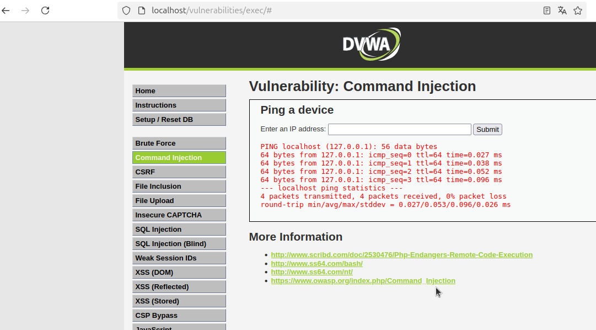

# Command Injection en DVWA

## Descripción

Este ejercicio trata sobre la vulnerabilidad de **Command Injection** en DVWA. Se nos proporciona una funcionalidad que permite hacer ping a un dispositivo ingresando una dirección IP o un dominio.

## Funcionamiento

1. Introducimos un valor en el campo de entrada, por ejemplo:

```bash
localhost
```

2. La aplicación nos devuelve el resultado del comando `ping` ejecutado en el servidor:



3. Dado que esto trata sobre **Command Injection**, es probable que el backend simplemente concatene nuestra entrada al comando `ping`. Esto nos permite inyectar comandos arbitrarios.

## Explotación

Podemos aprovechar la vulnerabilidad usando el operador **pipe (`|`)** para ejecutar comandos adicionales.  
Por ejemplo, al ingresar:

```bash
localhost | ls
```

El servidor ejecutará `ping localhost | ls`, lo que listará los archivos en el directorio actual.

Salida esperada:


## Impacto

Si la vulnerabilidad no está mitigada, un atacante podría ejecutar comandos arbitrarios en el servidor, lo que podría llevar a la exfiltración de datos, escalación de privilegios o incluso tomar control completo del sistema.

## Solución

Para prevenir este tipo de ataques, se recomienda:

- Validar y sanitizar la entrada del usuario.
- Usar listas blancas de valores permitidos.
- Ejecutar comandos de manera segura sin concatenar directamente la entrada del usuario.
