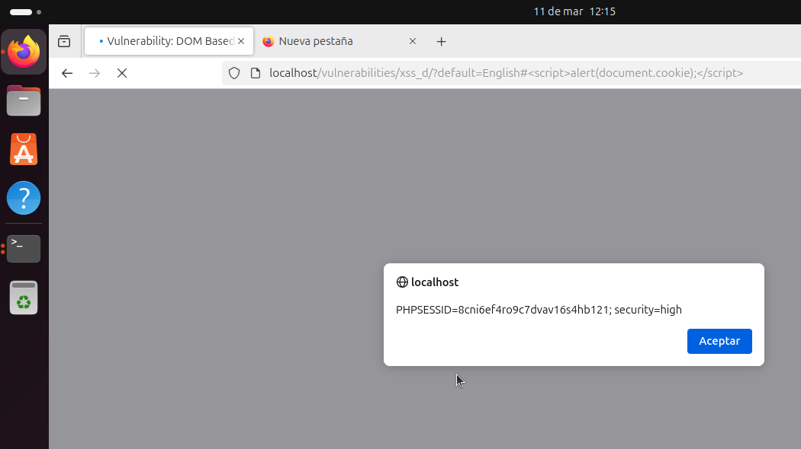

# DOM Based Cross Site Scripting (XSS) - DVWA (Security Level: High)

## Descripción del Ataque

En el nivel de seguridad **alto**, el servidor puede implementar técnicas para prevenir muchos tipos de **XSS**. Sin embargo, **DOM-based XSS** es un tipo de ataque en el que el código malicioso no es procesado por el servidor, sino que se inyecta y se ejecuta en el navegador del cliente. Esto ocurre cuando los datos del usuario se manipulan en el lado del cliente, como el DOM, sin validación ni escape adecuados.

En este caso, vamos a explotar un **DOM-based XSS** en una aplicación vulnerable como **DVWA**.

### **Payload Utilizado:**

**Payload:**

```html
#<script>alert(document.cookie);</script>
```

Este **payload** inyecta un script de JavaScript que, cuando se ejecuta en el navegador, muestra una alerta con las cookies del documento. Este tipo de **XSS reflejado** no requiere que el servidor filtre el código, ya que se ejecuta a nivel del cliente.

### Explicación del Proceso

1. **DOM-based XSS**: En este ataque, el código JavaScript malicioso se ejecuta directamente en el cliente (en el navegador), utilizando datos del DOM. En vez de que el servidor refleje el payload, es el propio cliente quien lo interpreta y lo ejecuta.

2. **Uso del `#` en la URL**: Colocamos el payload después del `#` en la URL. Lo interesante aquí es que cualquier cosa que esté después del `#` no es enviada al servidor, pero el navegador puede reflejarla en el DOM. Si la aplicación no valida adecuadamente los datos en el lado del cliente, el código puede ejecutarse en el navegador.

3. **Ejecutar un script malicioso**: En este caso, el script que insertamos es un simple `alert(document.cookie)`, que mostrará las cookies del navegador. Este tipo de ataque es útil para obtener información sensible almacenada en las cookies, como el `PHPSESSID`, que se puede utilizar para la suplantación de sesión (session hijacking).

### Proceso para Realizar el Ataque

#### Paso 1: Identificar la vulnerabilidad

En DVWA, navega hasta una sección que te permita interactuar con los datos del usuario (por ejemplo, un campo de búsqueda). El servidor puede estar manipulando directamente esos datos en el DOM sin validarlos adecuadamente.

#### Paso 2: Inyectar el Payload

Para realizar el ataque, simplemente ingresa el siguiente payload en un campo de entrada o modifica la URL directamente:

```html
#<script>alert(document.cookie);</script>
```

Este payload aprovechará la vulnerabilidad en el cliente, y si la aplicación no valida los datos correctamente, el script se ejecutará y mostrará las cookies del navegador en una alerta.


