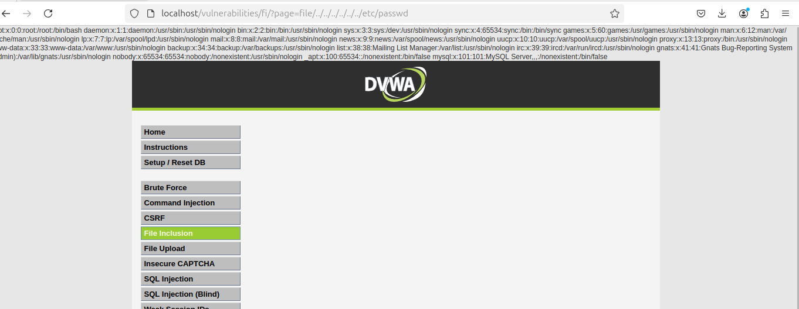

# File Inclusion en DVWA (Security Level: High)

## Descripción

En este desafío de **File Inclusion**, la aplicación permite incluir archivos a través de una ruta proporcionada por el usuario. Sin embargo, existe una restricción: el nombre del archivo debe comenzar con `file`.

## Explotación

Podemos aprovechar una vulnerabilidad de **Path Traversal** para acceder a archivos sensibles del sistema.  
Dado que el backend concatena nuestra entrada con la ruta del archivo, podemos intentar escapar de la restricción utilizando:

```bash
file/../../../../../../etc/passwd
```

### Salida esperada:



Si la explotación es exitosa, se mostrará el contenido del archivo `/etc/passwd`, que contiene información sobre los usuarios del sistema.

## Impacto

Si esta vulnerabilidad no está mitigada, un atacante puede:

- Acceder a archivos críticos del sistema.
- Leer archivos de configuración con credenciales sensibles.
- Incluir archivos PHP y ejecutar código malicioso (si es **Remote File Inclusion**).

## Solución

Para prevenir esta vulnerabilidad, se recomienda:

- Restringir los archivos que pueden incluirse mediante listas blancas.
- No permitir entradas del usuario sin validación y sanitización.
- Usar rutas absolutas y seguras en el código backend.

