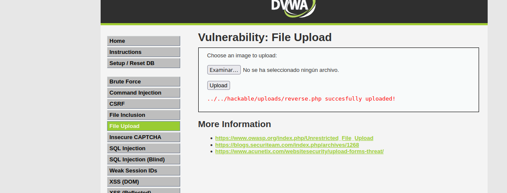
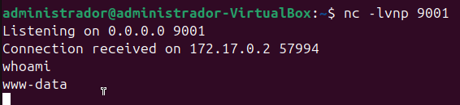

# File Upload - Reverse Shell en DVWA (Security Level: Low)

## Descripción

En este ejercicio, aprovechamos la funcionalidad de subida de archivos en **Damn Vulnerable Web Application (DVWA)** para ejecutar una **Reverse Shell**.  
Esto nos permitirá obtener acceso remoto a la máquina objetivo.

## Pasos para Exploitar la Vulnerabilidad

### 1. Crear un archivo PHP de Reverse Shell  
Utilizamos una reverse shell en PHP que, cuando se ejecute en el servidor, establecerá una conexión con nuestra máquina atacante.  

El código de la reverse shell se encuentra en el siguiente archivo:

➡️ [assets/code/reverse.php](assets/code/reverse.php)  

Puedes generar una shell personalizada en [RevShells](https://www.revshells.com/).

### 2. Configurar el Listener en la Máquina Atacante  
Antes de ejecutar la shell, debemos abrir un **listener** en nuestra máquina para recibir la conexión.  
Usamos **netcat** con el siguiente comando:  

```bash
nc -lvnp 9001
```

Las opciones utilizadas son las siguientes:

- `-l`: Escucha conexiones entrantes.
- `-v`: Modo detallado.
- `-n`: No resuelve nombres DNS.
- `-p 9001`: Usa el puerto 9001 para escuchar.

## 2. Subir el Archivo rev.php

1. Accede a DVWA en la sección **File Upload**.
2. Sube el archivo `rev.php`. Este archivo contiene un código que establece una conexión reversa a la máquina atacante.




Una vez subido, DVWA lo almacenará en la carpeta `/hackable/uploads/`.

## 3. Ejecutar la Reverse Shell

Para ejecutar la shell reversa, visita la URL del archivo subido en tu navegador:

```bash
http://192.168.1.57/hackable/uploads/rev.php
```

## 3. Ejecutar la Reverse Shell

Cuando el archivo se ejecute, se establecerá una conexión entre la máquina víctima y el "listener" que configuraste en el paso anterior.

## 4. Verificar Acceso

Si la shell se ejecuta correctamente, deberías ver algo similar a esto en tu terminal de la máquina atacante:



