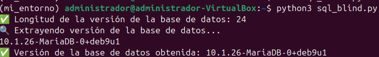

# SQL Injection - DVWA (Security Level: High)

## Payload para Detectar Vulnerabilidad

En el nivel de seguridad **alto**, utilizamos el siguiente **payload** para detectar una vulnerabilidad de **Blind SQL Injection**:

**Payload:**

```sql
1' and sleep(5)#
```

Este **payload** provoca una demora de 5 segundos en la respuesta, lo que nos permite identificar que la vulnerabilidad de **Blind SQL Injection** está presente si el tiempo de respuesta se ve afectado.

### Python Code para Realizar Brute Force de la Versión de la Base de Datos

El siguiente código en Python realiza un **brute force** para obtener la versión de la base de datos utilizando una **Blind SQL Injection**. El proceso es el siguiente:

1. **Paso 1:** Encontrar la longitud de la versión de la base de datos.
2. **Paso 2:** Extraer la versión de la base de datos, carácter por carácter.

### Código Python

El código completo para realizar el ataque está disponible en el archivo `assets/code/sql_blind.py`.

[Ver código completo de la inyección SQL en `sql_blind.py`](assets/code/sql_blind.py)

### Explicación del Código:

- **Paso 1:** **Detectar la longitud de la versión**
    - Utilizamos un ataque de inyección SQL con la función `length(version())` para determinar la longitud de la versión de la base de datos. La respuesta de la aplicación se tarda más tiempo si la longitud es correcta.

- **Paso 2:** **Extraer la versión carácter por carácter**
    - Después de obtener la longitud de la versión, utilizamos un bucle para extraer la versión de la base de datos carácter por carácter utilizando la función `substring(version(),i,1)` y `ascii()` para obtener el valor ASCII de cada carácter.

El código realiza este ataque de **Blind SQL Injection** de manera efectiva y muestra la versión de la base de datos de **MariaDB** (en este caso: `10.1.26-MariaDB-0+deb9u1`).

### Output:

Cuando el código se ejecuta correctamente, el resultado será algo similar a este:


