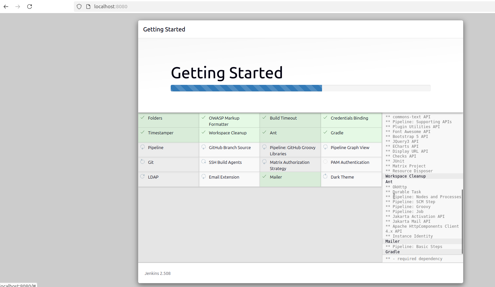
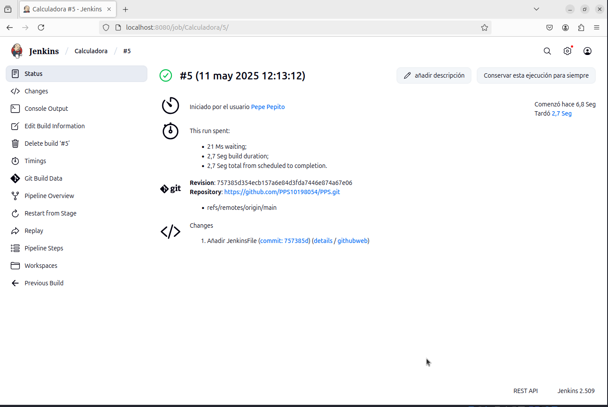
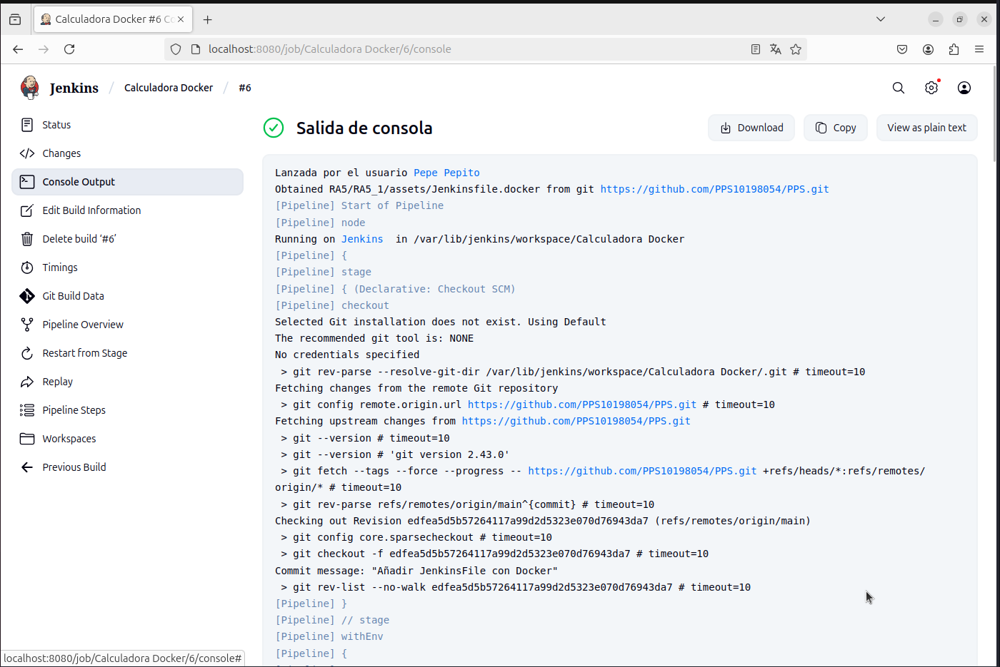

# CI/CD con Jenkins y Docker

Este documento describe el procedimiento completo para la instalación de Jenkins, Docker y Docker Compose en sistemas basados en Debian/Ubuntu, así como la configuración de pipelines de integración y entrega continua mediante los archivos `Jenkinsfile` y `Jenkinsfile.docker`.

---

## 1. Instalación de Jenkins

### 1.1. Instalación de Java

Jenkins requiere Java para su funcionamiento. Se utiliza OpenJDK 17:

```bash
sudo apt install openjdk-17-jdk -y
```

###1.2. Adición del repositorio oficial de Jenkins

```bash
curl -fsSL https://pkg.jenkins.io/debian-stable/jenkins.io.key | sudo tee \
  /usr/share/keyrings/jenkins-keyring.asc > /dev/null

echo deb [signed-by=/usr/share/keyrings/jenkins-keyring.asc] \
  https://pkg.jenkins.io/debian-stable binary/ | sudo tee \
  /etc/apt/sources.list.d/jenkins.list > /dev/null
```

###1.3. Instalación de Jenkins

```bash
sudo apt update
sudo apt install jenkins -y
```

###1.4. Inicio y habilitación del servicio Jenkins

```bash
sudo systemctl start jenkins
sudo systemctl enable jenkins
```

###1.5. Acceso a Jenkins

Navegar a: http://localhost:8080



Obtener la contraseña inicial con:
```bash
sudo cat /var/lib/jenkins/secrets/initialAdminPassword
```
Una vez iniciada la sesión, se recomienda seguir el asistente de configuración e instalar los complementos sugeridos.
###2. Instalación de Docker y Docker Compose
###2.1. Instalación de Docker
```bash
sudo apt install docker.io -y
sudo systemctl start docker
sudo systemctl enable docker
```
###2.2. Inclusión del usuario en el grupo docker

Permite ejecutar comandos Docker sin necesidad de utilizar sudo:
```bash
sudo usermod -aG docker $USER
```
Es necesario cerrar sesión o reiniciar el sistema para aplicar los cambios de grupo.

###2.3. Instalación de Docker Compose
```bash
sudo apt install docker-compose -y
```

###2.4. Verificación de la instalación
```bash
docker --version
docker-compose --version
```

###3. Automatización CI/CD con Jenkins
###3.1. Pipeline básica (Jenkinsfile)

Este pipeline define etapas típicas de compilación, prueba y despliegue:

[Ver Jenkinsfile](assets/Jenkinsfile)

### Estructura general de la pipeline

- `stage("Build")`: Compila el proyecto.
- `stage("Test")`: Ejecuta los tests definidos.
- `stage("Deploy")`: Realiza el despliegue (si es necesario).

La pipeline está configurada para ejecutarse automáticamente con cada `push` al repositorio.

Este archivo debe ser almacenado como Jenkinsfile en la raíz del repositorio y referenciado desde un job de tipo Pipeline en Jenkins.



###3.2. Pipeline con Docker (Jenkinsfile.docker)

Se implementa una versión avanzada del pipeline que utiliza Docker para cada etapa del flujo de trabajo:
Funcionalidades incluidas:

   Ejecución de la pipeline dentro de un contenedor Docker

   Construcción de una imagen Docker

   Ejecución de dicha imagen

   Pruebas automatizadas en el contenedor

   Uso de docker-compose para orquestación

Contenido del archivo Jenkinsfile.docker:

[Ver Jenkinsfile Docker](assets/Jenkinsfile.docker)

Este Jenkinsfile ejecuta cada paso de la CI dentro de contenedores Docker. Contiene los siguientes stages:

- `Docker Agent`: Usa una imagen base de Docker para ejecutar la pipeline.
- `Build Docker Image`: Crea una imagen de Docker con el código del proyecto.
- `Run Container`: Lanza un contenedor a partir de esa imagen.
- `Run Tests`: Ejecuta los tests dentro del contenedor.
- `Docker Compose`: Usa `docker-compose` para levantar servicios definidos en el repositorio.

Archivo docker-compose.yml:


### Servicios definidos

- **app**: Servicio principal que ejecuta la aplicación.
- **test**: Contenedor encargado de ejecutar los tests automatizados.
- (añadir más si los hay)

### Ejecución manual (opcional)

```bash
docker compose -f RA5/RA5_1/assets/docker-compose.yml up --build
```
Esto construirá y levantará los servicios según la definición del archivo. Para detenerlos:

```bash
docker compose -f RA5/RA5_1/assets/docker-compose.yml down
```

Este archivo también debe estar en la raíz del repositorio.


