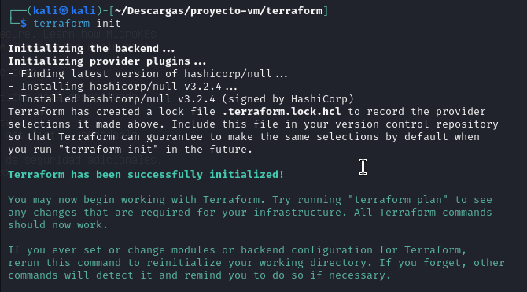
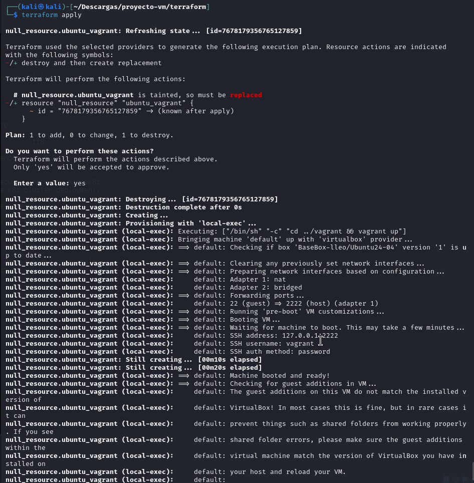
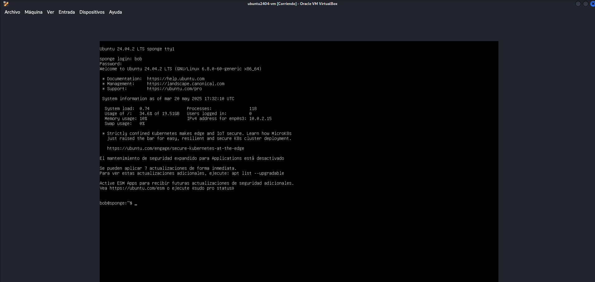

# 🧩 3.1 - Provisionar una Máquina Virtual Ubuntu 24.04 con Terraform y Vagrant

Este apartado describe cómo usar **Terraform** junto con **Vagrant** y **VirtualBox** para crear y provisionar una máquina virtual Ubuntu 24.04 de forma automatizada.

---

## 📦 Requisitos Previos

Asegúrate de tener instalados en tu sistema:

- [Vagrant](https://www.vagrantup.com/downloads)
- [VirtualBox](https://www.virtualbox.org/wiki/Downloads)
- [Terraform](https://developer.hashicorp.com/terraform/downloads) *(ya explicado en secciones anteriores)*

---

## 📄 Vagrantfile

Define una máquina virtual con estas características:

- **Box base**: `BaseBox-lleo/Ubuntu24-04`
- **Nombre de la VM**: `ubuntu2404-vm`
- **Red privada**: IP fija `192.168.56.101`
- **Hardware**: 2 CPUs y 2 GB de RAM
- **SSH**: Usuario `vagrant`, contraseña `vagrant`
- **Desactiva carpeta compartida** (`/vagrant`)
- **Provisionamiento** básico con `apt update && upgrade`

Puedes ver el contenido completo del archivo [`Vagrantfile`](assets/code/Vagrantfile).

## ⚙️ Terraform - `main.tf`

Este archivo de **Terraform** no crea directamente una máquina virtual, sino que **invoca a Vagrant** para que la levante. Es útil cuando queremos integrar una infraestructura ya definida con Vagrant dentro de un flujo de trabajo de automatización con Terraform.

Puedes ver el contenido completo del archivo [`main.tf`](assets/code/main.tf).

### 🚀 Inicializar y aplicar Terraform

Una vez tengas definido el archivo `main.tf`, sigue estos pasos desde el directorio `terraform/`:

1. **Inicializa Terraform** (esto descarga los plugins necesarios):

```bash
terraform init
```



### ⚙️ Aplicar la configuración con Terraform

Aplica la configuración (esto ejecutará `vagrant up`):

```bash
terraform apply
```


Terraform te pedirá confirmación antes de proceder. Escribe `yes` cuando lo solicite.

✅ **Nota:** Terraform no crea directamente la máquina virtual.  
Simplemente ejecuta el comando `vagrant up`, lo que hace que **Vagrant** inicie la máquina virtual definida previamente en el `Vagrantfile`.


