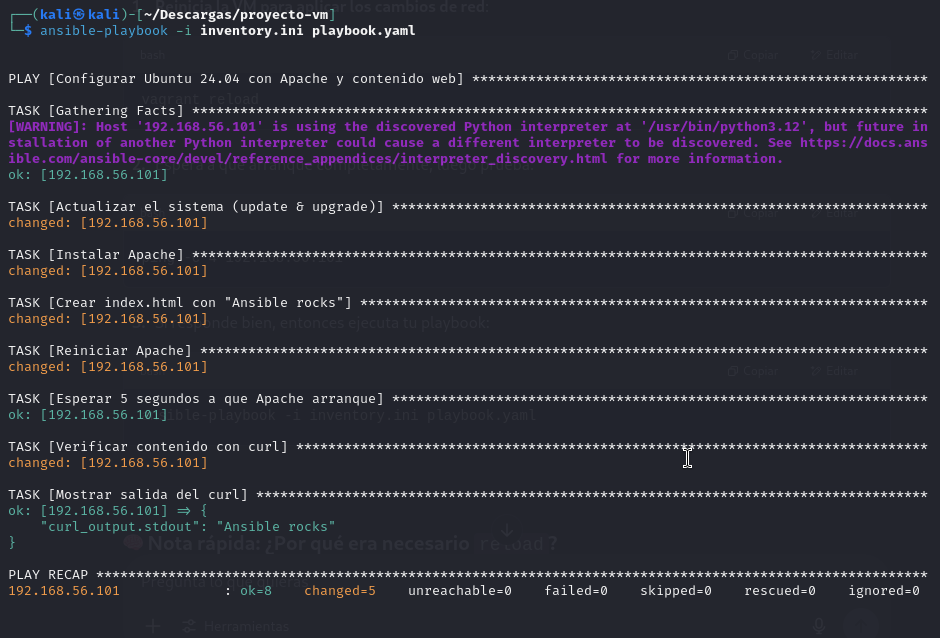

# 🧩 3.2 & 3.3 - Configurar VM Ubuntu 24.04 con Ansible

En esta sección automatizamos la configuración de una máquina virtual Ubuntu 24.04 usando **Ansible**. Esta VM fue creada previamente con Vagrant y orquestada con Terraform.

---

## ¿Qué archivos usamos?

- **Inventory**: Define la máquina objetivo donde Ansible ejecutará las tareas. Especifica la IP, usuario SSH y parámetros para evitar advertencias de seguridad SSH.
  
- **Playbook**: Contiene las instrucciones para actualizar el sistema, instalar Apache, crear un archivo web personalizado y verificar que el servidor funciona correctamente.

---

## ¿Qué hace la automatización?

1. Actualiza el sistema operativo Ubuntu para tener los paquetes al día.
2. Instala el servidor web Apache.
3. Crea un archivo `index.html` en el directorio raíz del servidor con el texto “Ansible rocks”.
4. Reinicia el servicio Apache para que los cambios tengan efecto.
5. Verifica que el servidor responde correctamente mostrando el contenido esperado mediante un `curl`.

---

## Enlaces al código

- Puedes revisar el archivo del inventario [aquí](assets/code/inventory.ini)
- El playbook completo lo tienes [aquí](assets/code/playbook.yaml)

---

## Cómo ejecutar

Para aplicar la configuración solo tienes que ejecutar Ansible indicando el inventario y el playbook (ver en la documentación oficial de Ansible para más detalles).

---

## Comprobación visual

A continuación se muestran capturas reales que demuestran el correcto funcionamiento:

- **Ejecución del playbook Ansible**

- **Salida del curl con el mensaje esperado**

---

Con esta automatización, la VM Ubuntu queda configurada con un servidor Apache funcional y con contenido web personalizado listo para servir. Así se garantiza reproducibilidad y ahorro de tiempo.

