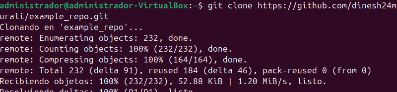
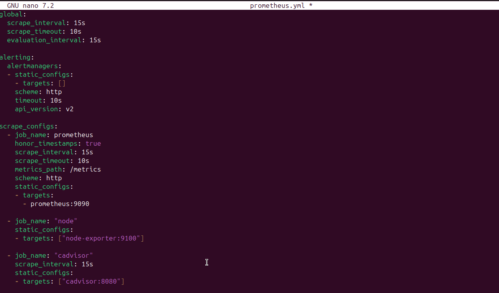
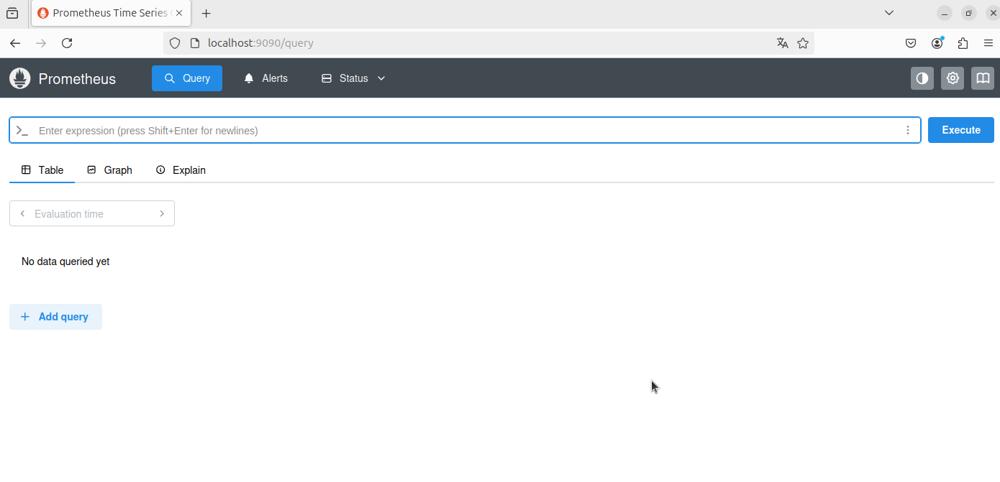
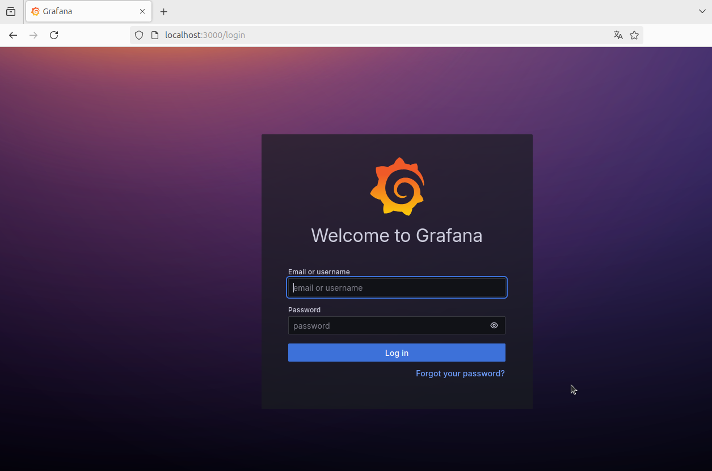
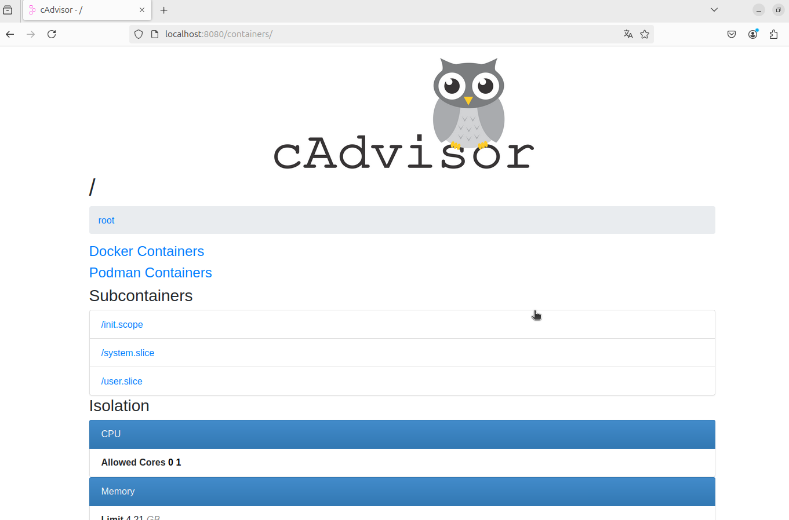
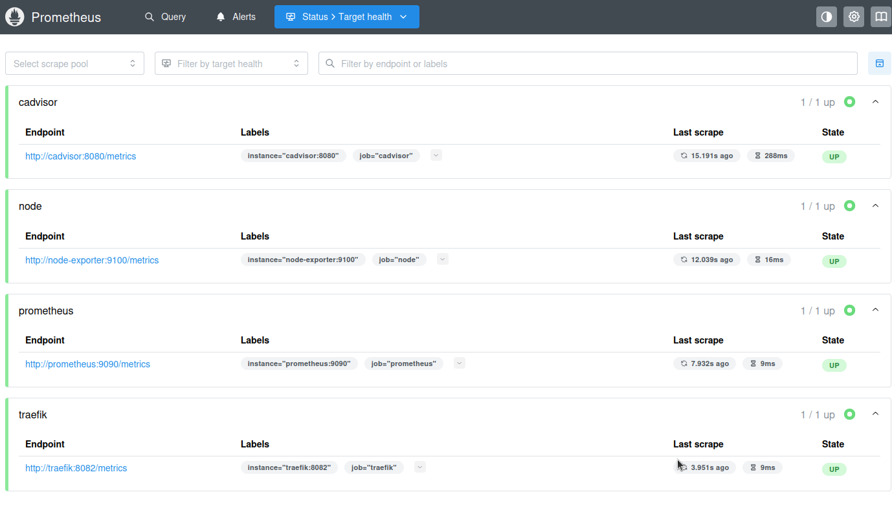

# Prometheus & Grafana Monitoring Stack

Este repositorio contiene un ejemplo básico para desplegar un stack de monitoreo usando **Prometheus**, **Grafana**, **cAdvisor**, **Node Exporter** y una aplicación Node.js de ejemplo, todo orquestado con Docker Compose.

---

## Requisitos previos

- Docker instalado y funcionando.
- Docker Compose instalado.
- Usuario con permisos para ejecutar Docker (o usar `sudo`).

---

## Pasos para levantar el stack

### 1. Clonar el repositorio

Primero clona el repositorio oficial desde GitHub y accede al directorio correspondiente:



---

### 2. Modificar la configuración de Prometheus

Dentro del repositorio clonado, antes de levantar el stack, debes cambiar un parámetro en `prometheus.yaml`.

Para evitar errores con Alertmanager, cambia en la sección `alerting` la línea:

```yaml
api_version: v1
```

por

api_version: v2



---

### 3. Levantar el stack

Finalmente, levanta todos los contenedores con:

```bash
docker-compose up -d
```

---

## 4. Validación en el navegador

Una vez que los contenedores estén levantados, abre tu navegador y verifica que los servicios estén funcionando:

- **Prometheus:** Accede a [http://localhost:9090](http://localhost:9090)  
  Debes poder ver la interfaz web de Prometheus y consultar métricas.




- **Grafana:** Accede a [http://localhost:3000](http://localhost:3000)  
  Usa las credenciales por defecto:  
  - Usuario: `admin`  
  - Contraseña: `admin`  
  Aquí puedes explorar los dashboards para visualizar métricas.



- **cAdvisor:** Accede a [http://localhost:8080](http://localhost:8080) (o el puerto que hayas configurado)  
  Debes poder ver el estado y métricas de los contenedores.



- **Node Exporter y aplicación Node.js:**  
  También deberían estar reportando métricas a Prometheus y visibles desde Grafana.

Si todos estos servicios están accesibles y funcionando, tu stack de monitoreo está correctamente desplegado y operativo.

---

## 5. Verificación de Targets en Prometheus

Además de acceder a los servicios vía navegador, puedes comprobar que Prometheus está recolectando métricas correctamente desde su interfaz:

1. Ve a [http://localhost:9090/targets](http://localhost:9090/targets).

2. En esta página verás una lista de todos los endpoints que Prometheus está monitoreando.

3. Todos los targets deben aparecer con el estado **UP**, lo que indica que Prometheus está recibiendo métricas correctamente de cada servicio.

Si alguno aparece como **DOWN**, revisa los logs y la configuración para identificar posibles problemas.

---

Con esto, tendrás una buena visión general de que tu stack de monitoreo está funcionando correctamente.


