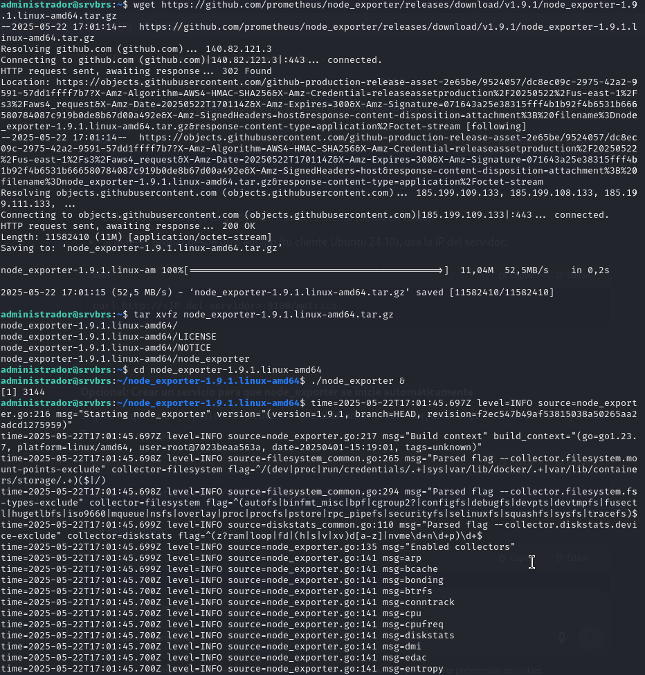
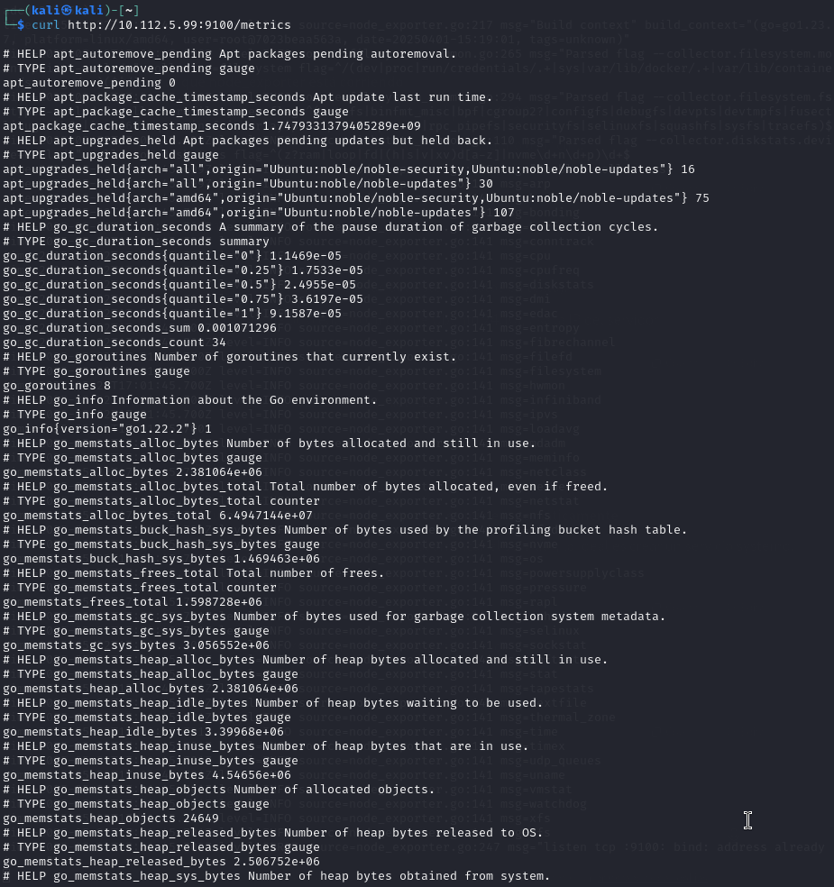
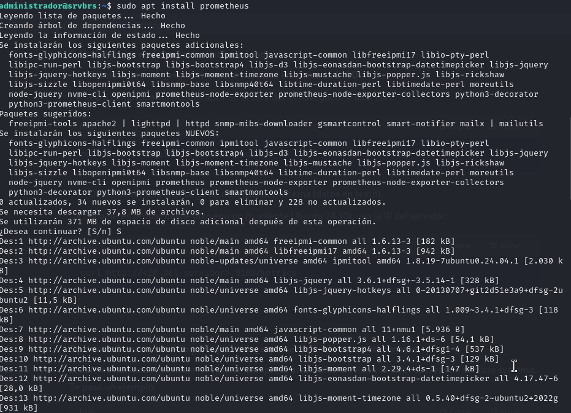
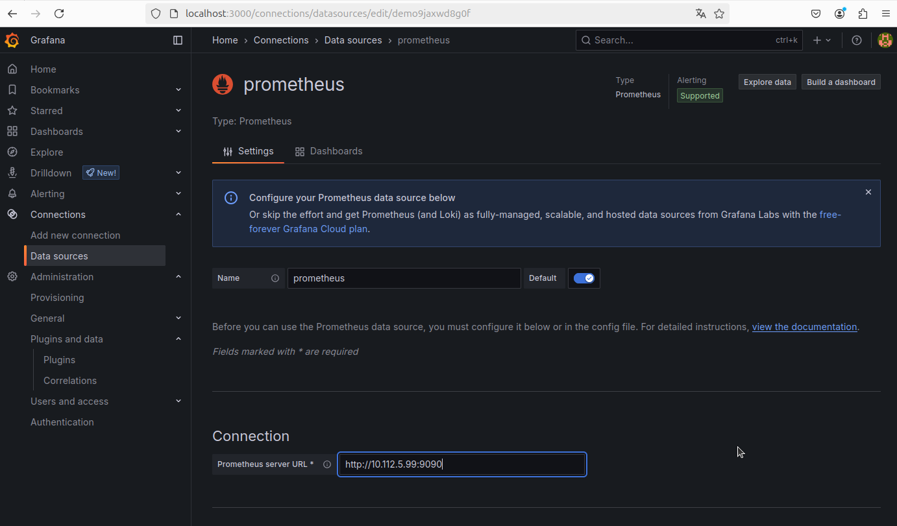
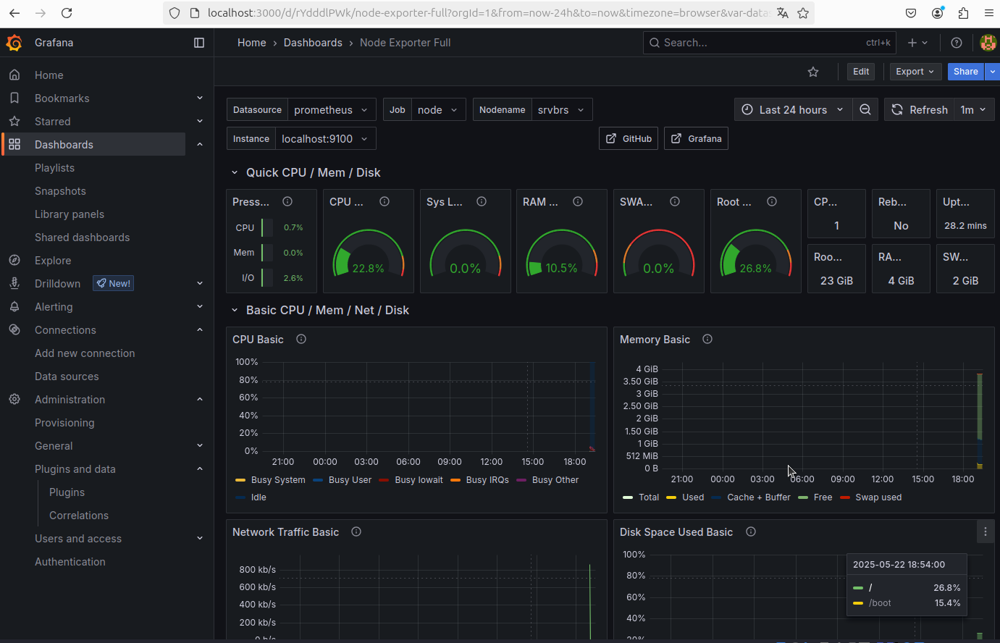

# Stack de Monitorización: Ubuntu Server + Ubuntu Desktop (Prometheus + Node Exporter + Grafana)

Este documento detalla los pasos realizados para desplegar un stack de monitorización usando **Prometheus**, **Node Exporter** y **Grafana**, donde:

- **Ubuntu Server 24.04** actúa como el servidor de métricas.
- **Ubuntu Desktop 24.10** actúa como cliente para visualización.

---

## 🧱 Infraestructura

[ Ubuntu Server 24.04 ]
Node Exporter + Prometheus
|
↓
[ Ubuntu Desktop 24.10 ]
Grafana (cliente visualizador)

---

## ✅ 1. Instalación y configuración de Node Exporter en Ubuntu Server

1. Se descargó la última versión de Node Exporter desde GitHub:
   ```bash
   wget https://github.com/prometheus/node_exporter/releases/download/v1.9.1/node_exporter-1.9.1.linux-amd64.tar.gz
   tar xvfz node_exporter-1.9.1.linux-amd64.tar.gz
   cd node_exporter-1.9.1.linux-amd64
   ./node_exporter &
   ```

---

## ✅ 1. Instalación y configuración de Node Exporter en Ubuntu Server

- Se descargó, descomprimió y ejecutó **Node Exporter** desde el sitio oficial.

📸 Captura: Instalación de Node Exporter  


- Se realizó una comprobación con `curl` para verificar que las métricas estuvieran accesibles en `http://localhost:9100/metrics`.

📸 Captura: Resultado del `curl` a Node Exporter  


- También se configuró opcionalmente como servicio systemd para ejecución permanente.

---

## ✅ 2. Instalación y configuración de Prometheus en Ubuntu Server

- Se instaló Prometheus mediante APT y se dejó ejecutando como servicio.

📸 Captura: Instalación de Prometheus  


- Se editó el archivo `/etc/prometheus/prometheus.yml` para definir los targets de monitoreo:

  ```yaml
  scrape_configs:

    - job_name: 'prometheus'
      static_configs:
        - targets: ['localhost:9090']

    - job_name: 'node'
      static_configs:
        - targets: ['localhost:9100']
   ```


- Se reinició el servicio para aplicar los cambios en Prometheus.

- Prometheus quedó accesible desde:  
  `http://10.112.5.99:9090/classic`

- Se confirmó en la ruta `/classic/targets` que los jobs están activos y en estado **UP**.

---

## ✅ 3. Instalación y configuración de Grafana en el cliente Ubuntu Desktop

- Se instaló Grafana desde su repositorio oficial y se habilitó como servicio.

📸 Captura: Instalación de Grafana  


- Se accedió a Grafana en:  
  `http://localhost:3000`

- Se inició sesión con `admin/admin` y se actualizó la contraseña al primer inicio.

---

## ✅ 4. Configuración de Prometheus como Data Source en Grafana

- En Grafana se añadió Prometheus como fuente de datos:

  - **URL utilizada:**  
    `http://10.112.5.99:9090`

- Se validó con éxito la conexión.

📸 Captura: Añadir Prometheus como fuente de datos  


---

## ✅ 5. Importación del Dashboard de Node Exporter

- Desde Grafana se accedió a:  
  **Dashboards → Import**

- Se utilizó el ID `1860`, correspondiente al dashboard oficial de Node Exporter.

- Se seleccionó el **data source Prometheus** configurado previamente.

- Se visualizaron correctamente las métricas del servidor, como:

  - CPU
  - Memoria
  - Disco
  - Red

📸 Captura: Dashboard Node Exporter mostrando métricas  


---

## 🧪 Validación Final

✔ Node Exporter está corriendo en el servidor y exponiendo métricas en el puerto 9100.  
✔ Prometheus está recolectando las métricas configuradas.  
✔ Grafana accede a Prometheus y representa métricas gráficamente desde otro equipo.  
✔ El stack completo funciona de forma remota y en tiempo real.
