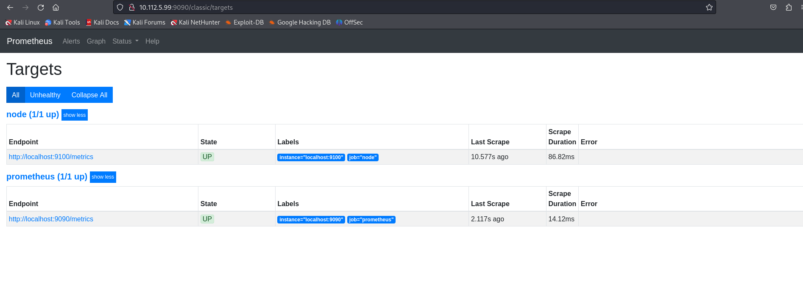

# 3.2. Stack de Monitorización: Ubuntu Server + Ubuntu Desktop

Este apartado describe cómo montar un stack de monitorización donde:

- **Ubuntu Server 24.04** actúa como servidor de métricas, ejecutando Prometheus y Node Exporter.
- **Ubuntu Desktop 24.04** (cliente) actúa como visualizador, ejecutando Grafana e importando el dashboard de Node Exporter.

---

## Estructura

[ Ubuntu Server 24.04 ]
Prometheus + Node Exporter
|
(Métricas expuestas)
↓
[ Ubuntu Desktop 24.04 ]
Grafana (cliente)
Dashboard Node Exporter

---

## 1. Instalación de Prometheus y Node Exporter en Ubuntu Server

En el servidor, se instalaron y configuraron:

- **Prometheus** para recolectar métricas.
- **Node Exporter** para exponer métricas del sistema (CPU, RAM, disco, etc.).

📸 Captura: Instalación de Prometheus  


📸 Captura: Prometheus ejecutándose correctamente  


> **Nota:** Asegúrate de que el puerto `9090` esté accesible desde la red para que Grafana pueda conectarse desde el cliente. Puedes comprobarlo con:
>
> ```bash
> sudo ufw allow 9090/tcp
> ```

---

## 2. Instalación de Grafana en Ubuntu Desktop (cliente)

En la máquina cliente se instaló Grafana siguiendo los pasos oficiales:

---

## 3. Configuración de Prometheus como fuente de datos en Grafana

Una vez Grafana está en marcha:

1. Se accede a [http://localhost:3000](http://localhost:3000).
2. Se añade Prometheus como **Data Source** apuntando a la IP del servidor Prometheus (por ejemplo: `http://10.112.5.99:9090`).
3. Se importa el Dashboard oficial de Node Exporter desde [Grafana Dashboards](https://grafana.com/grafana/dashboards/1860/).

📸 Captura: Añadir Prometheus como fuente de datos  


📸 Captura: Dashboard de Node Exporter mostrando métricas del servidor  


---

## 4. Validación

- Desde Grafana en el cliente, puedes ver en tiempo real las métricas del servidor remoto (Ubuntu Server).
- La comunicación se realiza vía HTTP entre Grafana y Prometheus.
- Prometheus recolecta métricas locales a través de Node Exporter.

> 💡 Consejo: Asegúrate de que ambos equipos estén en la misma red o que haya conectividad directa entre ellos para que Grafana pueda acceder a Prometheus.

---

## Resultado Final

El cliente Ubuntu Desktop puede visualizar de forma gráfica y remota el estado del servidor Ubuntu Server mediante Prometheus y Grafana, con métricas clave del sistema como CPU, memoria, red y disco.

---

