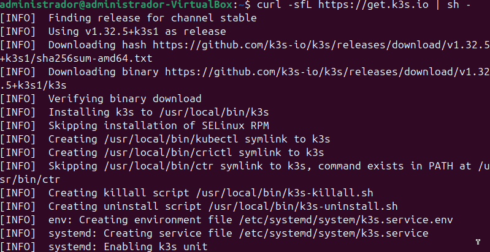
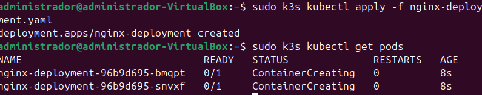
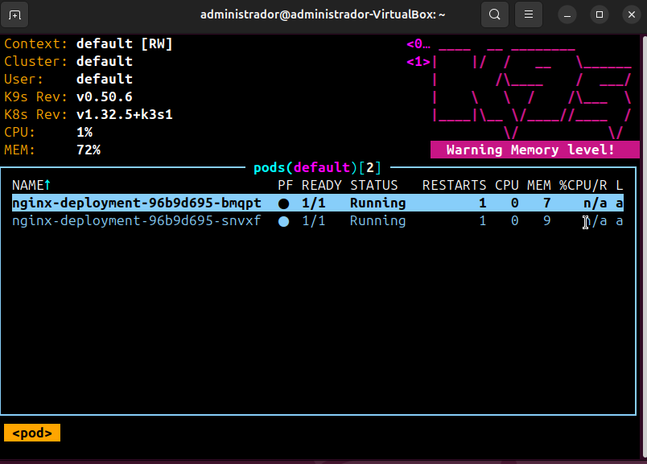

# 5.1 - Instalación y Despliegue de K3s (Single Node) con K9s

## 📌 Objetivo

Este apartado describe el proceso realizado para instalar y validar un clúster K3s en modo *single-node*, desplegar un servicio `nginx` con 2 réplicas y visualizar los recursos mediante la herramienta K9s.

---

## 🛠️ Proceso seguido

### 1. Instalación de K3s

Se realizó la instalación de K3s en una única máquina virtual. La instalación configuró automáticamente el nodo como *control-plane* y *master*, permitiendo administrar el clúster directamente desde esta máquina.

Se verificó que el nodo estuviera en estado `Ready` y correctamente integrado en el clúster.

---

### 2. Configuración de acceso a Kubernetes

Para poder utilizar `kubectl` como usuario sin privilegios root, se copió el archivo de configuración del clúster (`k3s.yaml`) a la ruta de configuración del usuario. Esto permitió ejecutar comandos y gestionar recursos desde el entorno de usuario normal.

---

### 3. Despliegue de nginx con 2 réplicas

Se creó un manifiesto `YAML` para definir un *Deployment* de `nginx` con 2 réplicas. Este archivo fue aplicado al clúster, lo que generó dos pods en ejecución que sirven contenido estático por el puerto 80.

Se comprobó que ambos pods estuvieran activos y en estado `Running`.

---

### 4. Instalación y validación con K9s

Se instaló la herramienta `K9s`, que permite visualizar gráficamente el estado de los recursos en el clúster Kubernetes desde la terminal. 

Una vez abierta la interfaz de K9s, se validó que el nodo, el deployment y los pods estuvieran correctamente creados y operativos.

---

## ✅ Validación

- El nodo se encuentra en estado *Ready*.
- El *Deployment* `nginx` muestra correctamente las 2 réplicas esperadas.
- Desde K9s se puede ver la estructura y el estado de los pods y servicios desplegados.
- Todo el proceso se ha documentado mediante capturas de pantalla.

---

## 📎 Notas

- Este entorno simula un clúster Kubernetes de un solo nodo, ideal para pruebas y aprendizaje.
- Se utilizó una máquina virtual con Ubuntu y VirtualBox.
- La instalación fue completamente local y no requiere conexión a un proveedor cloud.

---
